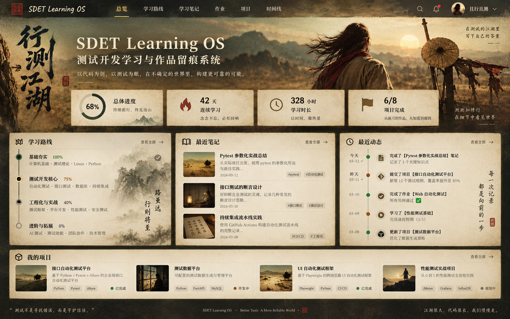

# CODEX_FRONTEND_PROMPT.md

## 0. 任务身份与执行方式

你正在改造现有 GitHub 仓库：

- Repository: `huayou712-maker/sdet-learning-roadmap`
- Default branch: `main`
- Product name: **SDET Learning OS**
- Product subtitle: **测试开发学习与作品留痕系统**

你的任务不是把现有 Markdown 简单套一层网页，而是把这个仓库升级为一个真正可长期使用的：

> **学习路线 + 学习笔记 + 作业提交 + 项目档案 + GitHub 留痕 + 求职作品集系统**

所有关键学习数据最终必须保存到 **同一个 GitHub 仓库**，通过 Git commit 形成长期、可追溯的学习记录。

### 执行原则

1. 先读取并理解现有文件，禁止覆盖或删除已有学习路线内容：
   - `README.md`
   - `CODEX_PROMPT.md`
   - `docs/ROADMAP.md`
   - `docs/RESOURCES.md`
   - `docs/PROJECTS.md`
   - `docs/PROGRESS.md`
2. 新建分支：
   - `feat/learning-os-web`
3. 分阶段开发，每个阶段完成后做独立 commit。
4. 不允许 `force push`。
5. 不允许把任何 GitHub Token、OAuth Secret、Auth Secret 写入源码、浏览器 bundle、日志或 Git 历史。
6. 每完成一个里程碑必须：
   - `npm run lint`
   - `npm run typecheck`
   - `npm run test`
   - `npm run build`
7. 若当前环境无法执行 GitHub/Vercel 外部配置，不得伪造成功状态；在最终结果中明确列出需要用户手工配置的步骤。
8. 实现过程中优先保持可维护性和可运行性，不要一次性生成不可验证的大量代码。
9. 所有业务写操作必须经服务端执行，客户端禁止直接持有 GitHub 写权限。

---

# 1. 现有项目背景

现有仓库已经定义了完整 SDET 学习路线，核心思想是：

- 不从头重学 Python，而是边项目边补
- 测试基础
- Python 核心能力
- Linux / Git / MySQL / Redis / Docker
- 接口自动化：`requests + pytest`
- Web UI 自动化：`Playwright + pytest + POM`
- 性能测试：JMeter
- CI/CD
- AI 辅助测试
- AI / RAG Evaluation
- 项目与求职准备

现有 `docs/PROGRESS.md` 已经是一个可以迁移为 Web Checklist 的学习状态清单。

现有 `docs/PROJECTS.md` 已定义 Project 0 ~ Project 5 的阶段项目要求。

这些文件继续保留，作为原始路线文档和长期参考。

---

# 2. 产品目标

将仓库升级为 **SDET Learning OS**。

核心用户是仓库所有者：

- GitHub Login: `huayou712-maker`

系统必须同时支持两种访问模式。

## 2.1 Owner Mode

当登录账号是 `huayou712-maker` 时，可以：

- 修改学习进度
- 新建 / 编辑 /删除学习笔记
- 提交作业
- 修改作业
- 提交项目成果
- 上传小型附件
- 新建 Debug Journal
- 新建 Daily Log
- 查看历史版本
- 管理 Portfolio 展示状态

## 2.2 Public Mode

未登录用户或其他 GitHub 用户：

- 只能查看允许公开展示的内容
- 不出现任何写操作按钮
- 不可调用写 API
- 可以查看 Roadmap、Portfolio、公开笔记、公开项目成果

---

# 3. 极重要的数据公开性说明

当前仓库是公开仓库。

因此：

> 任何提交进这个 GitHub 仓库的数据，本质上都是公开数据。

不要在 UI 中制造“私密笔记”的错误安全感。

允许提供字段：

```text
showInPortfolio: true | false
```

它只代表：

- 是否在 Portfolio 页面展示

它不代表：

- GitHub 中的数据是私密的

UI 中必须在首次写入内容前显示简短提示：

> 当前仓库为公开仓库，提交到 GitHub 的笔记、作业与项目记录可能被公开访问，请勿写入密码、Token、身份证号、私人账号等敏感信息。

---

# 4. 视觉参考图

必须将以下图片保存在仓库：

```text
docs/design/jianghu-ui-reference.png
```

Markdown 预览：



## 4.1 视觉目标

这张图是 **视觉方向参考**，不是让你把整张截图直接当网页背景。

不要照搬图中的人物、文字、布局像素。

需要提取的设计语言：

- 沙漠江湖
- 暖金色夕照
- 老纸 / 宣纸质感
- 墨色
- 暗棕
- 赭石
- 暗红印章
- 克制的墨绿 / 玉色
- 旧胶片颗粒感
- 东方排版
- 大留白
- 低饱和
- 电影感
- 简洁现代 Web App 信息架构

## 4.2 明确禁止

禁止把整个系统设计成常见 SaaS 风格：

- 禁止大面积蓝色
- 禁止大面积紫色
- 禁止蓝紫渐变
- 禁止 Neon / Cyberpunk
- 禁止玻璃拟态蓝紫卡片
- 禁止随处发光的按钮
- 禁止 Bootstrap 默认蓝
- 禁止 Tailwind Indigo/Purple 作为主色
- 禁止每个卡片都有明显 box-shadow

---

# 5. 视觉 Design Tokens

根据视觉参考图建立 CSS Variables。

推荐初始值：

```css
:root {
  --ink-950: #1f1b15;
  --ink-900: #2b251c;
  --ink-800: #362d20;

  --paper-50: #f1e7d3;
  --paper-100: #e8dbc2;
  --paper-200: #deceb0;
  --paper-300: #d0be9d;

  --sand-400: #a08c69;
  --sand-500: #826e4d;
  --sand-600: #68573b;

  --gold-500: #b58a3b;
  --gold-600: #9b712d;

  --crimson-600: #8f382b;
  --crimson-700: #742b22;

  --jade-600: #526651;
  --jade-700: #364a3b;
  --jade-800: #2c3d32;

  --muted: #756c5e;
  --border: rgba(54, 45, 32, 0.25);

  --success: #476348;
  --warning: #9b692e;
  --danger: #8f382b;
}
```

不要机械照抄；可微调，但整体必须保持参考图的暖色、低饱和、纸张与墨色基调。

## 5.1 字体

不要随仓库上传任何字体文件。

使用系统字体 / Web Safe fallback。

建议：

```css
--font-display:
  "Songti SC",
  "STSong",
  "Noto Serif SC",
  "Source Han Serif SC",
  serif;

--font-ui:
  -apple-system,
  BlinkMacSystemFont,
  "Segoe UI",
  "PingFang SC",
  "Microsoft YaHei",
  sans-serif;

--font-mono:
  "SFMono-Regular",
  Consolas,
  "Liberation Mono",
  monospace;
```

要求：

- Hero / 页面大标题：宋体 / Serif 气质
- UI 操作：清晰 Sans
- Code：Monospace
- “印章”可以使用 CSS / SVG 自绘，不依赖第三方书法字体

## 5.2 材质

允许：

- CSS noise / grain
- 极淡纸张纹理
- 细边框
- 渐变叠层
- 少量山水 / 墨迹 SVG 装饰

不允许为了视觉效果牺牲可读性。

正文区域对比度必须满足基本可访问性。

---

# 6. 技术栈

采用：

```text
Next.js (App Router)
React
TypeScript
Tailwind CSS
Auth.js
Octokit
Zod
gray-matter
react-markdown
remark-gfm
rehype-highlight
Vitest
React Testing Library
Playwright
ESLint
Prettier
```

包管理：

```text
npm
```

使用执行时最新稳定版，不追 beta / canary。

---

# 7. 总体系统架构

```text
Browser
   |
   v
Next.js Frontend
   |
   +----------> Public Read APIs
   |
   v
Auth.js Session
   |
   v
Server Route Handler / Server Action
   |
   +--> Authorization: githubLogin === huayou712-maker
   |
   +--> Zod validation
   |
   +--> GitHub Repository Adapter
             |
             v
        GitHub API / Octokit
             |
             v
huayou712-maker/sdet-learning-roadmap
```

---

# 8. GitHub 存储方案

GitHub 是长期真实数据源。

数据库不是 MVP 必需项。

第一版不要引入：

- MySQL
- PostgreSQL
- MongoDB
- Supabase
- Firebase

所有学习数据落 GitHub。

## 8.1 新增目录

```text
content/
├── notes/
│   ├── stage-01/
│   ├── stage-02/
│   ├── ...
│   └── stage-10/
│
├── assignments/
├── debug-journal/
├── daily/
├── project-submissions/
└── assets/

data/
├── roadmap.json
├── progress.json
└── profile.json
```

已有：

```text
docs/
README.md
```

继续保留。

---

# 9. Roadmap 数据模型

创建：

```text
data/roadmap.json
```

将现有 `docs/PROGRESS.md` 中的 Stage 1 ~ Stage 10 转成结构化数据。

示例：

```json
{
  "version": 1,
  "stages": [
    {
      "id": "stage-01",
      "order": 1,
      "title": "计算机基础",
      "description": "网络、操作系统、算法基础",
      "groups": [
        {
          "id": "network",
          "title": "网络",
          "items": [
            {
              "id": "network-tcp-udp",
              "title": "理解 TCP / UDP"
            }
          ]
        }
      ]
    }
  ]
}
```

Roadmap 结构是定义。

用户完成状态存：

```text
data/progress.json
```

不要把 `completed` 混进 `roadmap.json`。

---

# 10. Progress 数据模型

```json
{
  "version": 1,
  "updatedAt": "2026-09-08T12:00:00.000Z",
  "items": {
    "network-tcp-udp": {
      "completed": true,
      "completedAt": "2026-09-08T12:00:00.000Z",
      "evidence": [
        {
          "type": "note",
          "id": "note-uuid"
        }
      ]
    }
  }
}
```

点击 Checkbox：

```text
UI
→ PATCH /api/progress/:itemId
→ server auth
→ read latest progress.json + SHA
→ validate itemId exists
→ update JSON
→ GitHub commit
→ return new state
```

Commit Message：

```text
progress(stage-05): complete pytest fixture
```

或：

```text
progress(stage-05): reopen pytest fixture
```

---

# 11. Note 数据模型

每一篇 Note 是 Markdown。

路径：

```text
content/notes/stage-05/2026-09-08-pytest-fixture.md
```

Front Matter：

```yaml
---
id: 5f7d...
type: note
title: pytest fixture 学习笔记
stageId: stage-05
topicIds:
  - pytest-fixture
tags:
  - pytest
  - fixture
status: completed
showInPortfolio: false
createdAt: 2026-09-08T12:00:00.000Z
updatedAt: 2026-09-08T12:00:00.000Z
deletedAt: null
durationMinutes: 90
---
```

正文：

```markdown
# 今日学习内容

...

## 我的理解

...

## 示例代码

...

## 没搞懂的问题

...

## 总结

...
```

---

# 12. Assignment 数据模型

路径：

```text
content/assignments/<assignment-id>/<submission-id>.md
```

Front Matter：

```yaml
---
id: ...
type: assignment
assignmentId: python-api-tool
title: Python API 小工具
stageId: stage-02
status: submitted
iteration: 2
startedAt: ...
submittedAt: ...
updatedAt: ...
showInPortfolio: false
deletedAt: null
---
```

正文至少支持：

```text
作业要求
完成内容
代码路径
运行方式
遇到的问题
自我验收
反思
```

允许多次提交：

```text
Submission #1
Submission #2
Submission #3
```

不要覆盖历史提交。

---

# 13. Debug Journal 数据模型

路径：

```text
content/debug-journal/2026-09-08-<slug>.md
```

必须包含：

```text
现象
上下文
初始假设
排查过程
根因
修复方案
验证结果
预防方式
耗时
关联项目
```

这个页面很重要，因为后期面试可以直接作为问题排查案例库。

---

# 14. Daily Log 数据模型

路径：

```text
content/daily/2026/09/2026-09-08.md
```

字段：

```yaml
date:
plannedMinutes:
actualMinutes:
mood: optional
```

正文：

```text
今日目标
完成情况
今日学习
遇到的问题
明日计划
```

---

# 15. Project Submission 数据模型

不要只允许“上传一个 zip”。

项目成果必须结构化。

路径：

```text
content/project-submissions/<project-id>.md
```

Front Matter：

```yaml
---
id: project-api-automation
title: API 自动化测试框架
projectNo: 1
status: in_progress
showInPortfolio: true
startedAt: ...
completedAt: null
repositoryPath: projects/api-test-framework
externalRepository: null
demoUrl: null
reportUrl: null
---
```

正文：

```text
项目背景
目标
技术栈
架构设计
功能
测试范围
运行方法
成果
问题排查
复盘
```

项目 Checklist 根据现有 `docs/PROJECTS.md` 初始化。

例如 API 项目：

```text
GET
POST
PUT/PATCH
DELETE
Token
fixture
参数化
YAML / JSON
DB 校验
logging
Allure
GitHub Actions
```

---

# 16. Portfolio

新增公开路由：

```text
/portfolio
```

只显示：

```text
showInPortfolio: true
deletedAt: null
```

展示：

- 自我介绍
- SDET 技术栈
- 学习路线总体进度
- API 项目
- UI 自动化项目
- 性能项目
- RAG Evaluation
- 项目截图
- GitHub Commit/历史痕迹
- 测试报告链接
- 最近公开笔记

设计成真正能放到简历上的作品集，而不是后台管理页。

---

# 17. 页面 / Route 设计

至少实现：

```text
/
├── /roadmap
├── /notes
│   ├── /new
│   └── /[slug]
├── /assignments
│   └── /[id]
├── /projects
│   └── /[id]
├── /daily
├── /debug-journal
├── /timeline
├── /portfolio
├── /search
├── /trash
└── /settings
```

---

# 18. Dashboard `/`

Dashboard 必须参考视觉图中的信息架构，但不能只是复刻截图。

## Hero

包含：

```text
SDET Learning OS
测试开发学习与作品留痕系统
```

建议文案：

> 以代码为剑，以测试为眼，在不确定的系统里构建可靠性。

注意文案要短，不要整个页面堆武侠句子。

## Stat Cards

必须计算真实数据：

- 总体进度 %
- 连续学习天数
- 累计学习时间
- 项目完成数
- 笔记数
- 作业提交数

## Dashboard 主体

包含：

1. 学习路线摘要
2. 当前 Stage
3. 最近笔记
4. 最近动态
5. 项目摘要
6. 今日学习
7. 需要复习 / 未完成重点

---

# 19. Roadmap `/roadmap`

以 Stage Timeline 形式显示：

```text
Stage 1
Stage 2
...
Stage 10
```

每个 Stage 展开：

```text
Group
  ☑ item
  ☐ item
```

必须支持：

- Checkbox
- Progress %
- 筛选：
  - All
  - Completed
  - In Progress
- 每个知识点关联：
  - Note
  - Assignment
  - Project
  - Evidence

不能以“看完视频”为完成标准。

UI 中写：

> 完成知识点前至少留下一个有效输出：笔记、练习、作业、项目或问题复盘。

---

# 20. Notes `/notes`

必须支持：

- 创建
- 编辑
- 查看
- 搜索
- 标签
- Stage 筛选
- Topic 关联
- Markdown
- 代码高亮
- 表格
- Checklist
- 图片
- 删除
- 历史版本

编辑器建议：

```text
Desktop:
Markdown Editor | Preview

Mobile:
Editor / Preview Tab
```

不要使用无法控制主题色、强制蓝紫风格的编辑器 UI。

可以自己实现：

```text
textarea + react-markdown
```

---

# 21. 保存机制

不要每输入一个字符就 Git commit。

采用两层保存。

## 21.1 本地草稿

编辑时：

```text
localStorage
```

每 3 ~ 5 秒保存草稿，防误关闭。

草稿不是正式长期存储。

## 21.2 GitHub 正式保存

按钮文案：

```text
保存并提交到 GitHub
```

点击后：

```text
POST/PUT API
→ Commit
→ 返回 Commit SHA
```

成功 UI：

```text
已保存
Commit: abc1234
```

---

# 22. 删除策略

默认不是永久删除。

第一次删除：

```text
deletedAt = timestamp
```

保留文件。

在 UI 中移动到：

```text
/trash
```

Trash 支持：

- Restore
- Permanently Delete

永久删除调用 GitHub Delete File API。

必须明确：

> 即使永久删除当前文件，Git 历史仍可能保留旧版本。

---

# 23. Version History

每篇 Note / Project / Assignment 页面增加：

```text
History
```

显示：

- Commit
- 时间
- Commit message

至少支持：

```text
查看历史版本
```

V1 可以增加：

```text
Compare
Restore
```

History 直接来自 GitHub commits for path。

---

# 24. Evidence 系统

知识点不是单纯 Checkbox。

每个 Roadmap Item 可以绑定 evidence：

```text
Note
Assignment
Project
Debug Journal
Commit
```

例如：

```text
pytest fixture
完成：Yes

Evidence:
- pytest-fixture.md
- API Project
- commit abc123
```

Dashboard 可以统计：

```text
已完成但无 Evidence 的知识点
```

并提醒用户补留痕。

---

# 25. Timeline

`/timeline`

自动聚合：

- progress 更新
- note 创建
- note 修改
- assignment submission
- project update
- debug journal
- daily log

主要依据：

```text
content metadata
+
GitHub commit timestamp
```

样式参考图中“最近动态”。

---

# 26. Today / Daily

Dashboard 必须有 Today 卡片。

支持：

```text
今日目标
预计时长
实际时长
完成情况
晚间总结
明日计划
```

Today 不需要一开始做成复杂任务管理器。

保持轻量。

---

# 27. Search

至少支持：

```text
notes
assignments
projects
debug journal
roadmap item
```

MVP 不使用 Algolia / Elasticsearch。

数据规模预计较小，服务端生成 Search Index。

搜索字段：

```text
title
body excerpt
tags
stage
topic
```

---

# 28. GitHub Repository Adapter

必须封装，不允许 Route Handler 中散落 Octokit 代码。

目录：

```text
lib/github/
├── client.ts
├── contents.ts
├── commits.ts
├── authz.ts
└── paths.ts
```

至少实现：

```ts
getTextFile(path)
listDirectory(path)
createTextFile(path, content, message)
updateTextFile(path, sha, content, message)
deleteFile(path, sha, message)
getCommitsForPath(path)
getTextFileAtRef(path, ref)
```

二进制小附件：

```ts
createBinaryFile(...)
```

---

# 29. GitHub Branch

使用环境变量：

```text
GITHUB_CONTENT_BRANCH
```

默认：

```text
main
```

所有数据读写都必须尊重这个变量。

不要把 `main` 写死在业务逻辑。

这样后续可以切到：

```text
learning-data
```

避免内容 commit 与代码 commit 混杂。

第一版不要求自动创建 `learning-data` branch。

---

# 30. GitHub Commit Convention

统一：

```text
notes(stage-05): add pytest fixture note
notes(stage-05): update pytest fixture note
progress(stage-05): complete pytest fixture
assignment(stage-02): submit python api tool v2
project(api): update automation framework
debug: document token fixture failure
daily: add 2026-09-08 learning log
content: move note to trash
content: restore note from trash
```

---

# 31. Authentication

采用：

```text
Auth.js + GitHub OAuth
```

必须把 GitHub `login` 写进 session。

授权函数：

```ts
assertOwner(session)
```

只有：

```text
huayou712-maker
```

可以写。

不得根据页面是否隐藏按钮来判断权限。

所有写 API 服务端再次验证。

---

# 32. GitHub 写权限

推荐 MVP：

**Fine-grained Personal Access Token**

仅给：

```text
Repository:
huayou712-maker/sdet-learning-roadmap

Permissions:
Metadata: Read
Contents: Read and write
```

Token 只放服务器环境变量。

```text
GITHUB_WRITE_TOKEN
```

严禁：

```text
NEXT_PUBLIC_GITHUB_TOKEN
```

严禁：

```text
localStorage.setItem("github_token", ...)
```

严禁 Token 进入 React props / JSON response。

后续可替换 GitHub App，但 MVP 不需要增加复杂度。

---

# 33. Environment Variables

创建：

```text
.env.example
```

内容：

```bash
AUTH_SECRET=
AUTH_GITHUB_ID=
AUTH_GITHUB_SECRET=

GITHUB_WRITE_TOKEN=
GITHUB_OWNER=huayou712-maker
GITHUB_REPO=sdet-learning-roadmap
GITHUB_CONTENT_BRANCH=main
ALLOWED_GITHUB_LOGIN=huayou712-maker

NEXT_PUBLIC_SITE_NAME=SDET Learning OS
NEXT_PUBLIC_SITE_URL=http://localhost:3000
```

`.env.local` 必须 gitignore。

---

# 34. API Routes

建议：

```text
/api/auth/[...nextauth]

/api/roadmap
/api/progress
/api/progress/[itemId]

/api/notes
/api/notes/[id]
/api/notes/[id]/history

/api/assignments
/api/assignments/[id]

/api/projects
/api/projects/[id]

/api/debug-journal
/api/debug-journal/[id]

/api/daily
/api/daily/[date]

/api/assets

/api/search
/api/timeline

/api/trash/[id]/restore
/api/trash/[id]/permanent
```

GET 可以公开。

POST / PATCH / PUT / DELETE 必须 owner auth。

---

# 35. Validation

使用 Zod。

每个写接口验证：

- id
- title
- path
- slug
- stageId
- tags
- content length
- upload MIME
- upload size

必须阻止 path traversal：

```text
../
..
\
absolute path
```

路径只能写进白名单：

```text
content/
data/progress.json
projects/
```

不要允许前端传任意 repository path 后直接写。

---

# 36. Upload

第一版支持“小型学习附件”，不做网盘。

允许：

```text
png
jpg
jpeg
webp
gif
pdf
md
txt
json
yaml
yml
csv
jmx
```

限制：

```text
4 MB / file
```

禁止：

- exe
- apk
- dmg
- secret files
- `.env`
- SSH key
- binary executable

存储：

```text
content/assets/<entity-id>/<uuid>-<safe-name>
```

上传后 Markdown 可以引用附件。

对于大型项目：

> 不从浏览器上传完整大型 repo/venv/node_modules/zip。

项目代码使用 Git 正常提交进：

```text
projects/
```

或者记录外部 GitHub Repository URL。

---

# 37. Project 页面

每个 Project 页面展示：

```text
Status
Progress
Tech Stack
Checklist
Screenshots
README
Latest Commit
Report Links
Debug Records
Related Notes
```

状态：

```text
planned
in_progress
completed
archived
```

---

# 38. Portfolio 质量要求

Portfolio 不是内部 Dashboard 的复制。

必须清晰适合招聘方阅读。

建议顺序：

```text
Hero
Skills
Selected Projects
Testing Capability
Project Evidence
Recent Learning
GitHub Activity
About
```

项目至少展示：

- Problem
- Architecture
- Tests
- Result
- CI
- Report
- Debug case

不展示大量内部管理按钮。

---

# 39. Responsive

重点尺寸：

```text
>= 1440 desktop
1024 laptop
768 tablet
390 mobile
```

Desktop 参考图采用多栏。

Mobile：

- Hero 缩短
- 卡片纵向
- Roadmap timeline 单栏
- Nav 变 Drawer
- 笔记 Editor / Preview 变 Tab
- 隐藏纯装饰性大字

---

# 40. Accessibility

必须：

- 语义 HTML
- 按钮可键盘访问
- focus visible
- 表单 label
- aria-label
- 对比度足够
- 不仅依赖颜色区分状态

Focus Ring 使用：

```text
gold / ochre
```

不要默认蓝色 focus ring。

---

# 41. 动效

使用非常克制的动效。

允许：

- card hover 轻微抬升 1~2px
- opacity
- translateY 2~4px
- route transition
- progress animation

时间：

```text
150ms ~ 250ms
```

禁止：

- 粒子系统
- 大面积 parallax
- 霓虹 glow
- 复杂 Three.js
- 过度 motion

---

# 42. 目录结构

目标：

```text
sdet-learning-roadmap/
├── app/
│   ├── (public)/
│   ├── (workspace)/
│   ├── api/
│   ├── layout.tsx
│   └── globals.css
│
├── components/
│   ├── layout/
│   ├── dashboard/
│   ├── roadmap/
│   ├── notes/
│   ├── projects/
│   ├── timeline/
│   └── ui/
│
├── lib/
│   ├── auth/
│   ├── github/
│   ├── content/
│   ├── schemas/
│   ├── search/
│   └── stats/
│
├── content/
├── data/
├── projects/
├── docs/
│   ├── design/
│   │   └── jianghu-ui-reference.png
│   └── ...
├── tests/
├── e2e/
├── public/
├── .github/
│   └── workflows/
├── .env.example
├── package.json
├── next.config.*
├── tsconfig.json
└── README.md
```

不要求目录名称一字不差，但模块边界必须清晰。

---

# 43. State / Cache

GitHub 是 Source of Truth。

客户端不得把 localStorage 当正式数据源。

允许 localStorage 只保存：

```text
draft
UI preference
sidebar state
```

GitHub 成功 commit 后才显示“已永久保存”。

读取可做服务端缓存。

写入后：

```text
revalidatePath(...)
```

---

# 44. Conflict Handling

GitHub Update File 需要 SHA。

如果出现 409 / SHA mismatch：

不要覆盖远端。

UI 显示：

```text
GitHub 中的文件已发生变化，请刷新最新版本后重新保存。
```

提供：

```text
刷新远端版本
复制当前草稿
```

---

# 45. Error Handling

必须有统一 Error UI。

例如：

```text
GitHub API 暂时不可用
权限不足
文件冲突
文件过大
内容格式错误
登录过期
```

不要只 `console.error()`。

不要显示 Token 或完整服务器异常堆栈给用户。

---

# 46. Dashboard Statistics

统计逻辑必须真实，不写假数字。

## 总体进度

```text
completed roadmap items / total roadmap items
```

## 连续学习

按存在有效 Daily Log 或有效 GitHub 学习活动的日期计算。

## 学习时长

汇总：

```text
Daily.actualMinutes
+
Note.durationMinutes
```

避免重复统计；定义一个主来源。

建议主来源：

```text
Daily.actualMinutes
```

Note duration 只展示，不纳入总时长，避免重复。

## 项目完成

```text
completed project count / total project count
```

---

# 47. 初始数据迁移

Codex 必须从当前仓库已有文档初始化：

```text
docs/PROGRESS.md
docs/PROJECTS.md
docs/ROADMAP.md
docs/RESOURCES.md
```

生成：

```text
data/roadmap.json
data/progress.json
```

初始 `progress.json` 应保持当前 Markdown 的状态。

不要凭空打勾。

如果现有所有项目是未完成，就保持 false。

---

# 48. README 改造

现有 README 不能被完全删除。

升级 README：

1. 保留路线说明
2. 增加产品截图 / 视觉参考
3. 增加 Web App 介绍
4. 增加本地启动
5. 增加环境变量
6. 增加 GitHub OAuth 配置
7. 增加 Fine-grained PAT 配置
8. 增加 Vercel 部署
9. 保留学习路线 docs 链接
10. 增加安全提示

---

# 49. Testing

这是测试开发学习项目，所以项目本身必须有测试。

## Unit

Vitest：

- progress 计算
- streak 计算
- slug
- path validation
- front matter parse
- authorization helper
- schema validation

## Component

React Testing Library：

- Roadmap Checkbox
- Note Editor Save State
- Delete Confirm
- Project Checklist
- Public/Owner visibility

## E2E

Playwright：

至少：

```text
public user cannot see edit controls
owner can open editor
create note flow with mocked GitHub adapter
edit note
soft delete
restore
update roadmap progress
submit assignment
```

不要在 CI E2E 里真实写 GitHub 仓库。

GitHub Adapter 必须可以 mock。

---

# 50. CI

新增：

```text
.github/workflows/web-ci.yml
```

PR / push 执行：

```text
npm ci
npm run lint
npm run typecheck
npm run test
npm run build
```

E2E 可以独立 job。

CI 禁止使用真实 GitHub 写 Token。

---

# 51. Deployment

目标：

```text
Vercel
```

原因：

- Next.js 原生
- Server Route
- Secret env
- Auth callback

GitHub Pages 不适合作为本项目完整部署，因为需要服务端 secret 与 GitHub 写 API。

---

# 52. Vercel 手工配置说明

最终输出一份：

```text
docs/DEPLOYMENT.md
```

用户需要手工完成：

## GitHub OAuth App

填写 Homepage URL：

```text
https://<your-domain>
```

Callback：

```text
https://<your-domain>/api/auth/callback/github
```

## Vercel Env

设置：

```text
AUTH_SECRET
AUTH_GITHUB_ID
AUTH_GITHUB_SECRET
GITHUB_WRITE_TOKEN
GITHUB_OWNER
GITHUB_REPO
GITHUB_CONTENT_BRANCH
ALLOWED_GITHUB_LOGIN
NEXT_PUBLIC_SITE_URL
```

不要声称 Codex 可以替用户安全地产生这些 secret。

---

# 53. V0.1 ~ V1.0 实现顺序

Codex 必须按这个顺序开发。

## V0.1 — Read-only UI

完成：

- Next.js 初始化
- Design System
- Navbar
- Dashboard
- Roadmap
- Resources
- Projects
- Portfolio Skeleton
- Responsive
- 视觉风格

验收后 commit：

```text
feat(web): build SDET Learning OS read-only interface
```

## V0.2 — Auth + GitHub CRUD

完成：

- Auth.js
- Owner Check
- GitHub Adapter
- Notes CRUD
- Progress CRUD
- Soft Delete
- History
- Markdown Editor
- GitHub Commit

commit：

```text
feat(content): add GitHub-backed notes and progress
```

## V0.3 — Learning Management

完成：

- Assignments
- Project Submission
- Daily Log
- Debug Journal
- Timeline
- Search
- Evidence

commit：

```text
feat(learning): add assignments projects timeline and evidence
```

## V1.0 — Portfolio + Quality

完成：

- Portfolio
- Stats
- Testing
- CI
- Error handling
- Documentation
- Accessibility
- Performance
- Final polish

commit：

```text
feat(portfolio): complete SDET Learning OS v1
```

---

# 54. V1.0 Acceptance Criteria

以下全部通过才算完成。

## Functional

- [ ] 可以 GitHub 登录
- [ ] 只有 `huayou712-maker` 能写
- [ ] Public 用户完全只读
- [ ] Roadmap 可以打勾
- [ ] 勾选后生成 GitHub commit
- [ ] 可以创建 Note
- [ ] 可以编辑 Note
- [ ] 可以软删除 Note
- [ ] 可以恢复 Note
- [ ] 可以查看 History
- [ ] 可以提交 Assignment
- [ ] Assignment 保留多次提交
- [ ] 可以添加 Debug Journal
- [ ] 可以添加 Daily Log
- [ ] 可以提交 Project
- [ ] Project 可以展示到 Portfolio
- [ ] Timeline 自动生成
- [ ] Search 可以搜到学习内容
- [ ] Dashboard 统计不是假数据

## GitHub

- [ ] 所有关键数据存在 repository
- [ ] 每次正式保存产生 commit
- [ ] 无 token 泄漏
- [ ] GitHub Adapter 有单独模块
- [ ] SHA conflict 不覆盖数据

## UI

- [ ] 风格明显接近给出的“江湖 / 老纸 / 暖金 / 墨色”视觉语言
- [ ] 没有蓝紫 SaaS 主色
- [ ] Desktop 完整
- [ ] Mobile 可用
- [ ] Dark/Ink 区域可读
- [ ] Paper 卡片可读
- [ ] 操作按钮风格统一

## Quality

- [ ] TypeScript 无错误
- [ ] lint 通过
- [ ] unit test 通过
- [ ] build 通过
- [ ] 至少核心 E2E 通过
- [ ] README 完整
- [ ] DEPLOYMENT.md 完整

---

# 55. 不要做的事情

不要：

1. 删除现有学习路线 Markdown
2. 把 GitHub Token 放在客户端
3. 把 Token 写进 `.env.example`
4. 使用 Firebase/Supabase 代替 GitHub 存储
5. 将图片参考图直接铺满当网页
6. 创建一个纯静态、不能 CRUD 的假后台
7. 用 localStorage 冒充永久存储
8. 给 Public 用户提供隐藏但可调用的写 API
9. 自动硬删除学习内容
10. 一次性重写全部仓库后才测试
11. 使用大量蓝色 / 紫色
12. 使用假的统计数字
13. 随意制造几十个无用组件
14. 在仓库提交 `node_modules`
15. 提交 `.env.local`
16. 提交真实 OAuth Secret
17. 提交真实 GitHub PAT
18. 为了装饰使用难以阅读的书法字体作为正文
19. 复制影视剧具体人物、海报或画面作为产品素材

---

# 56. 后续 V1.1 可选功能

V1.0 稳定后再考虑：

- Spaced Repetition 复习
- 面试题库
- Mock Interview
- LeetCode 学习记录
- Knowledge Mastery 1~5
- GitHub contribution-like heatmap
- Project Report Viewer
- Allure Report 链接整合
- 学习周报生成
- Export Portfolio PDF
- Dedicated `learning-data` branch
- GitHub App 替换 Fine-grained PAT
- 多用户模式

这些不是 V1.0 阻塞项。

---

# 57. Codex 最终交付要求

完成后输出：

## A. 修改文件清单

说明新增 / 修改了什么。

## B. 架构说明

包括：

```text
Auth
GitHub Storage
Content Model
CRUD
UI
Testing
```

## C. 本地运行

给出：

```bash
npm install
cp .env.example .env.local
npm run dev
```

## D. 用户必须手工完成的 Secret 配置

明确区分：

```text
Codex 已完成
用户需要完成
```

## E. 验证结果

必须写真实结果：

```text
lint:
typecheck:
unit tests:
e2e:
build:
```

失败必须说明原因。

## F. Git

将代码推送至：

```text
feat/learning-os-web
```

若具备权限，创建 PR 到：

```text
main
```

PR 标题：

```text
feat: build GitHub-backed SDET Learning OS
```

不要自动 force merge。

---

# 58. 最后的产品判断标准

这个项目最后应该满足一句话：

> 用户每完成一次真正的学习活动，都可以留下可验证、可回看、可展示的 GitHub 证据。

最终闭环应为：

```text
学习
  ↓
笔记 / 练习
  ↓
作业
  ↓
项目
  ↓
Debug / Report
  ↓
Git Commit
  ↓
Timeline
  ↓
Portfolio
```

如果最终只是一个漂亮的 Roadmap 网页，则任务失败。

如果数据只存在浏览器里，则任务失败。

如果 GitHub Token 暴露给前端，则任务失败。

如果视觉最终变成普通蓝紫 SaaS，则任务失败。
