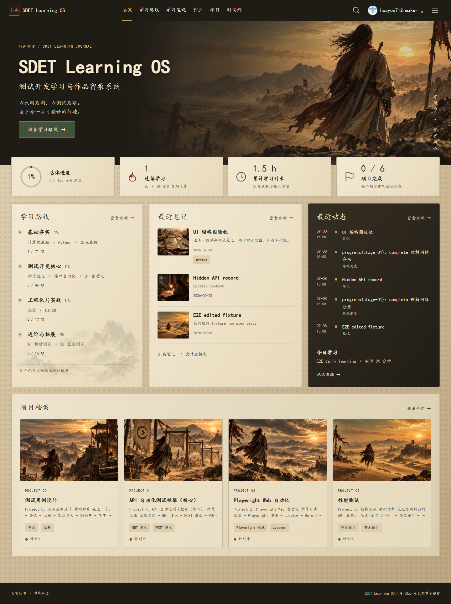

# 测试开发 / SDET 学习路线（2026）

面向准备实习 / 校招的测试开发初学者。先诊断，再用小练习推进；没有编程基础就先补基础。完成标准是可复现的测试、代码与排障证据。

## 今天从这里开始

1. [独立完成 Python 与环境诊断](projects/beginner-api-lab/DIAGNOSTIC.md)。
2. [运行首组注册 API 练习](projects/beginner-api-lab/README.md)，只使用本机合成数据。
3. [完成自己的测试与故障检出练习](projects/beginner-api-lab/EXERCISES.md)，再提交 GitHub 证据。

## 实践主线

| 顺序 | 实践任务                   | 过关依据                               |
| ---- | -------------------------- | -------------------------------------- |
| 1    | Python、环境与 Git 诊断    | 独立修改函数、解释输出、能运行虚拟环境 |
| 2    | 注册用例设计 + HTTP        | 说明边界、状态码、响应体与设计理由     |
| 3    | requests + pytest 首组测试 | 测试独立可重复；断言能发现错误实现     |
| 4    | 尽早接入最小 CI            | 有一次失败与修复记录，报告可下载       |
| 5    | SQL、鉴权与数据隔离        | API / DB 一致，失败也清理，能定位异常  |
| 6    | 2–3 个关键 UI 流程与作品   | 稳定定位、Trace、干净环境复现与复盘    |

每周根据实际耗时和验收结果调整计划，不设统一结业工期。计算机基础按需补，算法按目标岗位笔试要求穿插；性能、Redis、Docker 深入、Jenkins、AI / RAG 评测是后续选修。

## 课程入口

- [初学者实践指南](docs/BEGINNER_PATH.md)：任务、交付物与执行命令
- [十阶段知识目录](docs/ROADMAP.md)：查缺补漏，不是前置锁
- [项目验收规范](docs/PROJECTS.md)：必做、选择组与加分分开
- [免费课程资源](docs/RESOURCES.md)：按当前任务选择
- [旧版进度导入资料](docs/PROGRESS.md)：保留作兼容来源，不再维护正式状态

主技术栈：Python → requests / pytest → GitHub Actions → MySQL → pytest-playwright。
Python 先掌握条件、循环、函数、列表/字典、JSON 和异常，再逐步补类与封装。
UI 主学 Playwright；Selenium 按目标团队旧项目需要补，不要求先刷两套长课。

## 项目顺序与验收

先做 Project 0 用例设计，以 Project 1、Project 4、Project 2 形成基础作品：

- Project 0：选一个业务，提交 test-cases.md 与可复现缺陷报告。
- Project 1：API 测试 V0 先有 GET / POST、正常 / 异常输入和断言；V1 补 CRUD、鉴权、fixture 隔离；V2 在出现重复后抽象 API / Config，补数据库、日志和报告。最小 CI 在 V0 后接入。
- Project 4：最小 CI，必须验证失败会阻断并保留报告；缓存与 matrix 是加分项。
- Project 2：先写稳定的关键流程，再提取 POM、复用登录状态；失败保留截图和 Trace。
- Project 3：性能测试，进阶选修；只在自有或明确授权的隔离环境进行。
- Project 5：AI / RAG 评测，进阶选修；明确数据集、评判规则、版本与人工复核。

完整项目要求以 GitHub 中 data/projects.json 为准。选择组达到最低数量计 1 项；加分不计必做完成率。自评勾选不能代替复现验收。

## 正式进度与证据

通过 Web 学习系统将进度、作业、笔记与排障记录提交 GitHub，并关联 commit / 项目证据。data/progress.json 是正式进度，content/ 保存学习记录；localStorage 仅用于未提交草稿与非关键 UI 偏好。

不把本仓库维护者提供的演示代码和通过的测试冒充个人已完成成果。学习者需要提交自己的用例、解释、改进和运行记录。

## 参考路线

本仓库参考 [zhoujinjian/ai-testing-guide](https://github.com/zhoujinjian/ai-testing-guide) 的公开路线思想，作求职导向裁剪，不是原项目镜像。原文档采用 CC BY-NC-SA 4.0；若后续直接摘录正文，应保留署名并遵守许可证。

---

## SDET Learning OS Web App

本仓库已增加 GitHub-backed 学习系统：十阶段路线、150 项知识点、学习笔记、独立作业迭代、六个项目档案、日课、问题复盘、证据关联、时间线、搜索和公开作品集。原始路线文档继续保留。


暖纸、墨色与赭金的界面采用楷体字体栈和提供的江湖 WebP / PNG 素材，不上传字体，也不以整幅参考图充当网页背景。Header 提供独立 GitHub 登录与账户菜单。

### 实际界面

下图由隔离浏览器测试渲染，展示合成测试状态，不代表真实学习成果。



[查看手机首页截图](docs/design/dashboard-mobile-v2.png)

### 运行

```powershell
npm ci
Copy-Item .env.example .env.local
npm run dev
```

需要 Node.js 24；访问 `http://localhost:3000`。环境变量、GitHub OAuth App、Fine-grained PAT 和 Vercel 配置步骤见 [DEPLOYMENT.md](docs/DEPLOYMENT.md)。完整部署需要服务端，不使用 GitHub Pages。

### 数据与权限

- GitHub Repository 是唯一正式数据源；正常开发和生产都不使用本地业务文件后备存储。写入成功后显示 Git commit SHA。
- localStorage 只保存未提交草稿。正式笔记、进度、项目、附件均提交到所配置的 GitHub 内容分支，默认 `main`。
- 仅 `huayou712-maker` 可写；访客及其他登录账号只读，API 同样校验身份。
- 当前仓库公开。作品集开关只是展示筛选，不代表私密；永久删除也不会消除 Git 历史。不得提交密码、Token 或个人敏感信息。
- Web 状态以 `data/progress.json` 为准。原始 `docs/PROGRESS.md` 保留为迁移来源，不与 Web 进行双向同步。不要将两份清单当成两个正式状态源。

### 个人训练台

新增 `/training`：注册 API 独立练习验收、从笔记/排障提取复习卡，以及按到期复习、最新漏检和实践主线生成的今日建议。验收结果明确为学习者自报；不会执行提交代码、自动增加知识点进度或修改原记录。正式状态只提交 GitHub。

- [执行边界书](docs/TRAINING_EXECUTION_BOUNDARY.md)
- [训练台使用说明](docs/TRAINING_USER_GUIDE.md)

### 架构与验证

Next.js App Router + TypeScript + Tailwind；稳定版 next-auth 处理 GitHub OAuth；服务端 Octokit Adapter 统一 GitHub 读写；Zod 校验与 SHA 冲突保护；Markdown Front Matter 保存内容元数据。详见 [ARCHITECTURE.md](docs/ARCHITECTURE.md)。

```text
npm run lint
npm run typecheck
npm run test
npm run build
npm run test:e2e
```

CI 运行静态检查、单元/组件测试、构建和隔离浏览器测试，不向真实 GitHub 仓库写入测试数据。阶段提交依次为 V0.1、V0.2、V0.3、V1.0。
