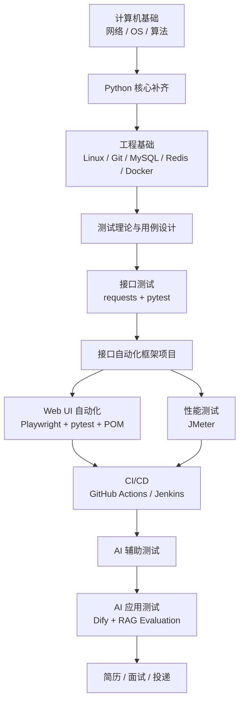
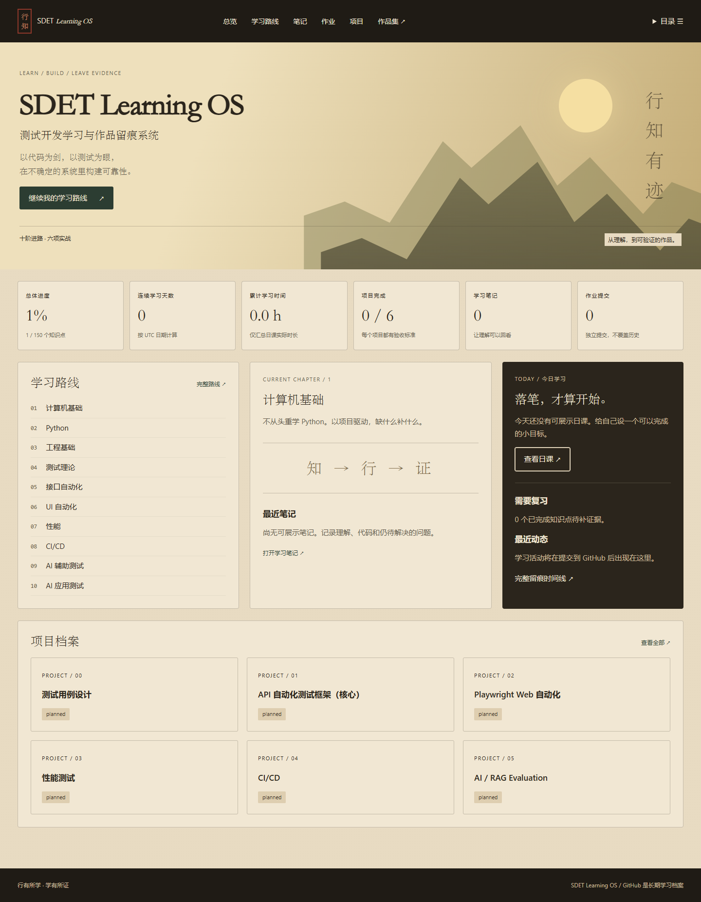

# 测试开发 / 测试工程师学习路线（2026）

> 面向：准备校招/实习的测试工程师、测试开发（SDET）方向学习者。  
> 核心原则：**不从头重学 Python；以项目驱动，缺什么补什么。**  
> 目标：从测试基础、接口自动化、UI 自动化、性能测试一路走到 CI/CD 与 AI 应用测试，最终形成可展示的 GitHub 项目。

## 路线总览



## 学习优先级

如果时间有限，按下面优先级执行：

1. Python 核心能力（边做边补）
2. 测试理论与测试用例设计
3. HTTP / 网络基础
4. Linux + Git + MySQL
5. requests + pytest 接口自动化
6. 一个完整可运行的接口自动化项目
7. Playwright UI 自动化
8. Docker + CI/CD
9. JMeter 性能测试
10. Redis
11. AI 辅助测试 / LLM 应用评测
12. 算法按校招笔试需求持续穿插

> **不要把“看完课程”当完成标准。** 每一阶段必须有输出：代码、测试用例、报告、README、CI 运行记录或项目成果。

## 课程入口

完整课程、观看范围、跳过内容和验收标准见：

- [完整学习路线](docs/ROADMAP.md)
- [免费课程资源清单](docs/RESOURCES.md)
- [阶段验收与项目](docs/PROJECTS.md)
- [学习进度 Checklist](docs/PROGRESS.md)

## 推荐主技术栈

```text
Python 3.x
requests
pytest
Playwright
MySQL
Redis（基础）
Linux
Git / GitHub
Docker
JMeter
GitHub Actions
Allure
Dify
LangSmith Evaluation
```

### Selenium 怎么处理？

主学 **Playwright**。Selenium 保留到“能看懂旧项目、能回答常见面试题”的程度即可：

- WebDriver 基本原理
- XPath / CSS Selector
- 显式等待 / 隐式等待
- POM

第一轮不要再完整刷一套 Selenium 长课。

## Python 学习原则

这条路线假设你已经接触过 Python，不再从 `print()`、变量、`if/for` 开始。

只补测试开发高频知识：

```text
list / dict / set / tuple
函数与参数
class / self / __init__
异常处理
模块与包
文件操作
JSON / YAML
pip / venv
logging
requests
pytest
```

遇到下面这种代码能自己写，就可以结束“纯 Python”阶段：

```python
import requests

class UserApi:
    def __init__(self, base_url: str):
        self.base_url = base_url

    def login(self, username: str, password: str):
        payload = {"username": username, "password": password}
        response = requests.post(
            f"{self.base_url}/login",
            json=payload,
            timeout=5,
        )
        response.raise_for_status()
        return response.json()
```

然后直接进入 `requests + pytest`。

## 最终应产出的 GitHub 项目

至少完成以下三个：

### Project 1：API 自动化测试框架

```text
api-test-framework/
├── api/
├── tests/
├── data/
├── utils/
├── conftest.py
├── pytest.ini
├── requirements.txt
└── README.md
```

必须具备：

- 登录 / Token 管理
- CRUD 接口测试
- fixture
- 参数化
- JSON / YAML 数据驱动
- 数据库校验
- 日志
- Allure 报告
- GitHub Actions 自动执行

### Project 2：Web UI 自动化项目

技术栈：

```text
Playwright + pytest + POM
```

必须具备：

- 登录状态复用
- Locator
- 自动等待
- Page Object
- 参数化
- 截图 / Trace
- 失败日志
- CI 执行

### Project 3：AI 应用测试 / RAG Evaluation

技术栈：

```text
Dify + Python + pytest + LangSmith（或同类评测工具）
```

至少测试：

- RAG 检索召回
- 答案正确性 / 忠实度
- 无答案场景
- Prompt 注入 / 越权边界
- 数据集回归
- Agent 工具调用成功 / 失败场景

## 学习时间建议

不是硬性工期。如果每天能投入约 2～3 小时，可以参考：

| 阶段 | 建议时间 |
|---|---:|
| 计算机基础（选学） | 1～2 周，穿插进行 |
| Python 核心补齐 | 3～7 天 |
| Linux / Git / MySQL / Redis / Docker | 1～2 周 |
| 测试理论 | 2～4 天 |
| 接口测试 + pytest | 2～3 周 |
| UI 自动化 | 1～2 周 |
| 性能测试 | 3～7 天 |
| CI/CD | 2～4 天 |
| AI 辅助测试 / AI 应用测试 | 后期 1～2 周起步 |
| 算法 | 全程每天 1～2 题 |

## 参考路线

本仓库是在以下公开路线基础上做的**校招/求职导向裁剪**，不是原项目镜像：

- `zhoujinjian/ai-testing-guide`：https://github.com/zhoujinjian/ai-testing-guide

原项目文档采用 CC BY-NC-SA 4.0；本仓库不复制其正文，只引用路线思想与公开链接。若后续直接摘录原项目内容，请保留原作者署名并遵守其许可证。

## 使用方式

建议每学完一个知识点就更新 [PROGRESS.md](docs/PROGRESS.md)，并在 GitHub commit 中留下学习轨迹，例如：

```text
feat(api): add login API tests
feat(pytest): add fixtures and parametrization
feat(db): verify user status with MySQL
ci: run pytest on GitHub Actions
feat(ui): add Playwright login page object
perf: add JMeter login scenario
```

最终目标不是“收藏了多少课”，而是 GitHub 上能看到：

> **学习记录 + 测试代码 + 自动化框架 + CI + 测试报告 + 对问题的分析。**

---

## SDET Learning OS Web App

本仓库已增加 GitHub-backed 学习系统：十阶段路线、150 项知识点、学习笔记、独立作业迭代、六个项目档案、日课、问题复盘、证据关联、时间线、搜索和公开作品集。原始路线文档继续保留。


暖纸、墨色与赭金的界面使用系统字体与 CSS 山形，不以整幅参考图充当网页背景。

### 实际界面

下图由隔离浏览器测试渲染，展示合成测试状态，不代表真实学习成果。



[查看手机首页截图](docs/design/dashboard-mobile.png)

### 运行

```powershell
npm ci
Copy-Item .env.example .env.local
npm run dev
```

需要 Node.js 24；访问 `http://localhost:3000`。环境变量、GitHub OAuth App、Fine-grained PAT 和 Vercel 配置步骤见 [DEPLOYMENT.md](docs/DEPLOYMENT.md)。完整部署需要服务端，不使用 GitHub Pages。

### 数据与权限

- GitHub Repository 是唯一正式数据源；正常开发和生产都不使用本地业务文件后备存储。写入成功后显示 Git commit SHA。
- localStorage 只保存未提交草稿。正式笔记、进度、项目、附件均提交到所配置的 GitHub 内容分支，默认 `main`。
- 仅 `huayou712-maker` 可写；访客及其他登录账号只读，API 同样校验身份。
- 当前仓库公开。作品集开关只是展示筛选，不代表私密；永久删除也不会消除 Git 历史。不得提交密码、Token 或个人敏感信息。
- Web 状态以 `data/progress.json` 为准。原始 `docs/PROGRESS.md` 保留为迁移来源，不与 Web 进行双向同步。不要将两份清单当成两个正式状态源。

### 架构与验证

Next.js App Router + TypeScript + Tailwind；稳定版 next-auth 处理 GitHub OAuth；服务端 Octokit Adapter 统一 GitHub 读写；Zod 校验与 SHA 冲突保护；Markdown Front Matter 保存内容元数据。详见 [ARCHITECTURE.md](docs/ARCHITECTURE.md)。

```text
npm run lint
npm run typecheck
npm run test
npm run build
npm run test:e2e
```

CI 运行静态检查、单元/组件测试、构建和隔离浏览器测试，不向真实 GitHub 仓库写入测试数据。阶段提交依次为 V0.1、V0.2、V0.3、V1.0。
